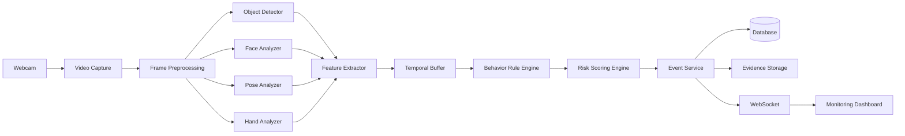
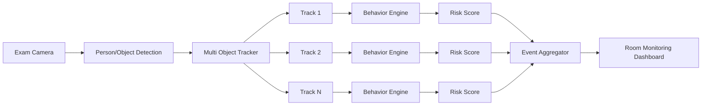

Smart Exam Proctoring System
Hệ thống thông minh hỗ trợ phát hiện các hành vi nghi vấn trong phòng thi từ camera/webcam theo thời gian thực.

1. Mục tiêu dự án
Dự án xây dựng một hệ thống Computer Vision có khả năng:
- Nhận video trực tiếp từ webcam/camera.
- Phát hiện và theo dõi thí sinh theo thời gian thực.
- Nhận diện các vật thể và hành vi có khả năng liên quan đến gian lận.
- Ghi lại các sự kiện nghi vấn kèm thời gian, bằng chứng và mức độ rủi ro.
- Hiển thị kết quả trực quan để giám thị/người quản lý xem lại.
- Mở rộng từ theo dõi 1 người sang nhiều người cùng lúc.
[!IMPORTANT]
Hệ thống không được tự kết luận một người đã gian lận.
AI chỉ đưa ra suspicious_event, confidence và risk_score. Kết luận cuối cùng phải do con người xem xét.

2. Phạm vi phát triển
Dự án được chia thành 2 phase chính.
Phase	Phạm vi	Mục tiêu
Phase 1	Single-person Proctoring	Xây dựng nền tảng ứng dụng và phát hiện hành vi nghi vấn của 1 thí sinh
Phase 2	Multi-person Proctoring	Mở rộng hệ thống để theo dõi và đánh giá nhiều thí sinh cùng lúc

3. Phase 1 — Single-person Proctoring
3.1. Mục tiêu
Phase 1 tập trung xây dựng phiên bản MVP hoàn chỉnh cho một thí sinh sử dụng webcam.
Luồng cơ bản:
Webcam
  ↓
Frame Capture
  ↓
Person / Object Detection
  ↓
Face + Pose + Hand Analysis
  ↓
Behavior Feature Extraction
  ↓
Temporal Analysis
  ↓
Suspicious Event Engine
  ↓
Risk Score
  ↓
Dashboard + Event Timeline
3.2. Giao diện chính
Ứng dụng tối thiểu phải có:
Camera View
Hiển thị:
- Webcam realtime.
- Bounding box của thí sinh.
- Face landmarks.
- Pose skeleton tùy chế độ debug.
- Bounding box các vật thể liên quan.
- FPS.
- Trạng thái camera.
- Trạng thái tracking.
- Risk score hiện tại.
Ví dụ:
┌────────────────────────────────────────────┐
│ Webcam                                     │
│                                            │
│        ┌──────── PERSON ────────┐          │
│        │                        │          │
│        │          🙂            │          │
│        │                        │          │
│        └────────────────────────┘          │
│                                            │
│ FPS: 22            Risk: 38/100            │
└────────────────────────────────────────────┘

Events
──────────────────────────────────────────────
10:12:14  LOOK_LEFT       Medium
10:12:42  PHONE_DETECTED  High
10:13:03  LOOK_DOWN       Medium
4. Các hành vi cần phát hiện
Không phải tín hiệu nào cũng có độ tin cậy giống nhau.
Các event phải được phân thành:
LOW
MEDIUM
HIGH
CRITICAL
4.1. Head Turn
Phát hiện thí sinh quay đầu sang trái/phải trong thời gian bất thường.
Event:
HEAD_TURN_LEFT
HEAD_TURN_RIGHT
Feature:
head_yaw
duration
frequency
Không tạo cảnh báo chỉ vì một lần quay đầu ngắn.
Ví dụ rule ban đầu:
abs(yaw) > 25°
AND duration > 1.5s
Threshold phải cấu hình được.
Severity mặc định:
MEDIUM
4.2. Looking Down
Phát hiện cúi đầu xuống bàn hoặc vùng ngoài màn hình trong thời gian dài.
Event:
LOOK_DOWN
Có thể là dấu hiệu:
- xem tài liệu;
- nhìn điện thoại;
- thao tác ngoài vùng camera.
Không được coi LOOK_DOWN riêng lẻ là bằng chứng gian lận.
Severity:
LOW → MEDIUM
tùy thời lượng và tần suất.
4.3. Abnormal Head Movement
Phát hiện việc liên tục:
- quay trái;
- quay phải;
- quay ra phía sau;
- cúi xuống;
- nhìn lên;
- thay đổi hướng đầu với tần suất cao.
Event:
ABNORMAL_HEAD_MOVEMENT
Đây là event tổng hợp từ một cửa sổ thời gian thay vì một frame đơn lẻ.
Ví dụ:
window = 30 seconds
head_turn_count >= configurable_threshold
4.4. Phone Detection
Phát hiện điện thoại xuất hiện trong vùng của thí sinh.
Event:
PHONE_DETECTED
Severity:
HIGH
Điều kiện nên kết hợp:
object = cellphone
confidence >= threshold
duration >= minimum_duration
Không phát cảnh báo chỉ từ một frame.
4.5. Unauthorized Document Detection
Phát hiện:
- sách;
- tài liệu;
- giấy ghi chú;
- tài liệu xuất hiện ngoài vùng cho phép.
Event:
DOCUMENT_DETECTED
Severity:
HIGH
Lưu ý:
Trong một số kỳ thi, giấy nháp hoặc đề thi là hợp lệ. Vì vậy hệ thống phải hỗ trợ:
exam_policy:
  allow_book: false
  allow_scratch_paper: true
  allow_phone: false
Rule engine phải dựa vào exam_policy thay vì coi mọi giấy tờ đều là gian lận.
4.6. Multiple Person
Trong Phase 1, phiên thi chỉ cho phép một thí sinh.
Nếu camera phát hiện:
person_count > 1
trong một khoảng thời gian đủ dài:
MULTIPLE_PERSON_DETECTED
Severity:
CRITICAL
4.7. Person Missing
Khi không còn phát hiện thí sinh trong webcam.
Event:
PERSON_MISSING
Ví dụ:
person_count == 0
AND duration > 2 seconds
Severity:
HIGH
4.8. Leaving Seat
Phát hiện thí sinh:
- đứng dậy;
- rời khỏi vị trí;
- di chuyển phần lớn cơ thể ra ngoài vùng thi.
Event:
LEAVING_SEAT
Có thể sử dụng:
- person bounding box;
- pose keypoints;
- vị trí torso;
- vùng allowed_exam_zone.
Severity:
MEDIUM → HIGH
4.9. Camera Blocking
Phát hiện camera:
- bị che;
- tối đột ngột;
- mất phần lớn hình ảnh;
- bị chuyển hướng.
Event:
CAMERA_BLOCKED
Có thể sử dụng:
brightness
image_entropy
blur_score
person_visibility
Severity:
HIGH
4.10. Face Missing
Trường hợp cơ thể vẫn xuất hiện nhưng khuôn mặt không được nhìn thấy trong thời gian dài.
Event:
FACE_NOT_VISIBLE
Ví dụ:
- quay hoàn toàn khỏi camera;
- che mặt;
- cúi quá thấp.
Severity:
MEDIUM
4.11. Suspicious Hand Interaction
Theo dõi tay và phát hiện các hành vi như:
- liên tục đưa tay xuống ngoài khung hình;
- cầm vật thể nghi ngờ;
- đưa tay lên tai nhiều lần;
- che mặt/camera.
Event:
SUSPICIOUS_HAND_ACTIVITY
Severity mặc định:
LOW
Đây chỉ là tín hiệu hỗ trợ vì có tỷ lệ false positive cao.
4.12. Talking / Mouth Movement
Có thể nghiên cứu phát hiện chuyển động miệng kéo dài.
Event:
POSSIBLE_TALKING
Tính năng này thuộc nhóm:
EXPERIMENTAL
Không được sử dụng độc lập để tăng mạnh risk score.
Nếu cần độ tin cậy cao hơn, có thể kết hợp audio ở giai đoạn sau nhưng audio không nằm trong phạm vi MVP Phase 1.
5. Event Model
Mọi hành vi nghi vấn phải được chuẩn hóa thành một event.
Ví dụ:
{
  "event_id": "evt_001",
  "session_id": "session_001",
  "track_id": 1,
  "event_type": "PHONE_DETECTED",
  "severity": "HIGH",
  "confidence": 0.91,
  "risk_score": 75,
  "started_at": "2026-09-19T10:10:12",
  "ended_at": "2026-09-19T10:10:16",
  "duration_ms": 4000,
  "evidence_frame": "evidence/evt_001.jpg"
}
6. Risk Scoring
Không đánh giá gian lận từ một frame đơn lẻ.
Risk score được tổng hợp từ nhiều event.
Khoảng điểm:
0 - 100
Gợi ý mức cảnh báo:
Score	Level
0–24	Normal
25–49	Low Risk
50–69	Medium Risk
70–84	High Risk
85–100	Critical

Ví dụ trọng số ban đầu:
Event	Weight
HEAD_TURN	8
LOOK_DOWN	8
ABNORMAL_HEAD_MOVEMENT	12
FACE_NOT_VISIBLE	15
LEAVING_SEAT	20
DOCUMENT_DETECTED	25
PHONE_DETECTED	30
CAMERA_BLOCKED	30
PERSON_MISSING	30
MULTIPLE_PERSON_DETECTED	40

Các giá trị trên chỉ là baseline và phải được hiệu chỉnh bằng dữ liệu thực nghiệm.
Risk score nên:
- tăng khi event kéo dài;
- tăng khi event lặp lại;
- tăng khi nhiều event liên quan xuất hiện đồng thời;
- giảm dần khi không còn hành vi bất thường;
- không cộng vô hạn;
- được giới hạn trong [0, 100].
Ví dụ:
PHONE_DETECTED
+
LOOK_DOWN
+
SUSPICIOUS_HAND_ACTIVITY

→ risk cao hơn nhiều so với LOOK_DOWN độc lập.
7. Temporal Behavior Analysis
Hành vi phải được đánh giá theo chuỗi thời gian.
Không sử dụng:
if current_frame_is_suspicious:
    cheating = True
Thay vào đó:
Frame Features
      ↓
Temporal Buffer
      ↓
Sliding Window
      ↓
Rule Evaluation
      ↓
Event Aggregation
Ví dụ:
HEAD_TURN_LEFT

frame 1      true
frame 2      true
frame 3      false
frame 4      true
...
Event chỉ được tạo khi điều kiện tồn tại đủ lâu.
Cấu hình:
behavior:
  head_turn:
    yaw_threshold: 25
    min_duration_ms: 1500

  look_down:
    pitch_threshold: 20
    min_duration_ms: 1500

  phone:
    confidence_threshold: 0.60
    min_duration_ms: 800
8. Technical Stack
8.1. AI / Computer Vision
Ngôn ngữ:
Python 3.12+
Framework:
PyTorch
OpenCV
Ultralytics YOLO
MediaPipe
NumPy
Vai trò:
Technology	Responsibility
OpenCV	Camera capture, frame processing, drawing
YOLO	Person/Object detection
MediaPipe Face	Face landmarks
MediaPipe Pose	Body pose
MediaPipe Hands	Hand landmarks
PyTorch	Model training/fine-tuning
NumPy	Feature processing

9. Detection Models
Object Detection
Các class quan trọng:
person
cell_phone
book
document
note_paper
Baseline có thể dùng model pretrained.
Các object đặc thù như:
note_paper
exam_document
earpiece
nên được fine-tune bằng dataset riêng nếu thực sự cần đưa vào production.
10. Face & Head Pose
Sử dụng Face Landmarks để lấy các điểm:
nose
eyes
chin
mouth
face contour
Sau đó ước lượng:
yaw
pitch
roll
Ví dụ:
yaw   → quay trái/phải
pitch → cúi/ngẩng
roll  → nghiêng đầu
Trong MVP, ưu tiên head pose hơn suy luận chính xác eye gaze, vì webcam phổ thông, ánh sáng và độ phân giải có thể làm gaze estimation thiếu ổn định.
11. Pose Analysis
Pose landmarks được dùng cho:
LEAVING_SEAT
BODY_TURN
LEANING
HAND_POSITION
PERSON_VISIBILITY
Các keypoint quan trọng:
shoulder
elbow
wrist
hip
nose
12. Phase 1 Architecture

13. Backend
Framework:
FastAPI
Backend chịu trách nhiệm:
- session management;
- event management;
- configuration;
- exam policy;
- health check;
- WebSocket realtime event;
- lưu lịch sử;
- evidence metadata.
REST API ví dụ:
POST   /api/sessions
GET    /api/sessions/{id}
POST   /api/sessions/{id}/start
POST   /api/sessions/{id}/stop

GET    /api/sessions/{id}/events
GET    /api/events/{event_id}

GET    /api/config
PUT    /api/config

GET    /api/health
WebSocket:
/ws/sessions/{session_id}
Realtime payload:
{
  "type": "event.created",
  "data": {
    "event_type": "PHONE_DETECTED",
    "severity": "HIGH",
    "confidence": 0.91,
    "risk_score": 75
  }
}
14. Frontend
Khuyến nghị:
React
TypeScript
Vite
Tailwind CSS
Frontend gồm:
Dashboard
CameraView
DetectionOverlay
RiskIndicator
EventTimeline
SessionControl
Settings
EventReview
State realtime lấy qua:
WebSocket
REST API dùng cho:
history
configuration
session metadata
event review
15. Database
Phase 1
Có thể sử dụng:
SQLite
để giảm độ phức tạp khi phát triển local.
Tables tối thiểu:
sessions
events
event_evidence
system_config
exam_policy
Phase 2
Chuyển sang:
PostgreSQL
để hỗ trợ:
- nhiều session;
- nhiều camera;
- nhiều thí sinh;
- dữ liệu lớn hơn;
- query/report tốt hơn.
16. Evidence Storage
Không lưu toàn bộ video mặc định.
Ưu tiên:
event frame
+
short event clip
Ví dụ:
5 giây trước event
+
event duration
+
5 giây sau event
Cấu trúc:
storage/
└── sessions/
    └── session_001/
        ├── frames/
        └── clips/
Production có thể chuyển sang object storage tương thích S3.
17. Configuration
Không hard-code threshold trực tiếp trong source code.
Ví dụ:
camera:
  width: 1280
  height: 720
  target_fps: 20

detection:
  person_confidence: 0.55
  object_confidence: 0.60

behavior:
  head_turn:
    yaw_threshold: 25
    min_duration_ms: 1500

  look_down:
    pitch_threshold: 20
    min_duration_ms: 1500

  person_missing:
    min_duration_ms: 2000

  multiple_person:
    min_duration_ms: 1000

risk:
  decay_per_second: 1.0
  maximum_score: 100
18. Phase 2 — Multi-person Proctoring
18.1. Mục tiêu
Phase 2 mở rộng hệ thống để:
1 camera
→ N people
→ N tracks
→ N behavior states
→ N risk scores
Ví dụ:
Camera
 ├── Student #12 → Risk 20
 ├── Student #13 → Risk 76
 ├── Student #14 → Risk 05
 └── Student #15 → Risk 48
19. Multi Object Tracking
Pipeline:
Frame
 ↓
Person Detection
 ↓
Multi Object Tracker
 ↓
Track IDs
 ↓
Per-person Pose / Face / Object Association
 ↓
Per-track Temporal Buffer
 ↓
Per-track Behavior Engine
 ↓
Per-track Risk Score
Mỗi người phải có:
track_id
bbox
pose
head_pose
associated_objects
behavior_state
risk_score
event_history
20. Tracking Strategy
Baseline ưu tiên:
ByteTrack
vì đơn giản và phù hợp làm mốc ban đầu.
Có thể thử:
BoT-SORT
khi cần:
- ReID;
- giảm ID switch;
- camera có chuyển động;
- cảnh đông người hơn.
Phase 2 phải đo:
ID Switch
Track Loss
Occlusion Recovery
Track Fragmentation
Không được giả định tracker luôn duy trì đúng ID.
21. Object-to-Person Association
Trong Phase 2, phát hiện một điện thoại là chưa đủ.
Hệ thống phải xác định:
PHONE
  ↓
belong_to
  ↓
TRACK_ID
Có thể dùng:
- bbox overlap;
- khoảng cách từ object tới wrist;
- khoảng cách tới torso;
- nearest tracked person;
- temporal consistency.
Ví dụ:
phone_bbox
+
person_15.left_wrist
+
person_15.bbox

→ associate phone with track_id=15
22. Seat / Region Mapping
Nếu camera quan sát phòng thi cố định, nên chia thành vùng:
SEAT_01
SEAT_02
SEAT_03
...
Mapping:
track_id → seat_id
Điều này giúp:
- giảm ID switch;
- xác định người theo vị trí;
- thống kê theo chỗ ngồi;
- giảm nhầm object giữa hai thí sinh.
23. Phase 2 Architecture

24. Dashboard Phase 2
Dashboard phải hỗ trợ:
Room View
Student Grid
Risk Ranking
Event Stream
Student Detail
Event Replay
Không dùng "Risk Ranking" để kết luận ai gian lận; nó chỉ ưu tiên các track có nhiều sự kiện cần giám thị xem lại.
Ví dụ:
┌──────────────────────────────────────────────┐
│ ROOM A                                       │
│                                              │
│ #01  18     #02  22     #03  79 ⚠           │
│ #04  10     #05  07     #06  45             │
│                                              │
└──────────────────────────────────────────────┘
Click vào thí sinh:
Student #03
Risk: 79

10:01 HEAD_TURN_RIGHT
10:04 PHONE_DETECTED
10:04 LOOK_DOWN
10:07 PHONE_DETECTED
25. Project Structure
smart-exam-proctoring/
│
├── apps/
│   ├── api/
│   │   └── FastAPI backend
│   │
│   └── web/
│       └── React frontend
│
├── ai/
│   ├── detectors/
│   │   ├── person_detector.py
│   │   └── object_detector.py
│   │
│   ├── tracking/
│   │   ├── single_tracker.py
│   │   └── multi_tracker.py
│   │
│   ├── face/
│   │   ├── landmarks.py
│   │   └── head_pose.py
│   │
│   ├── pose/
│   │   └── pose_estimator.py
│   │
│   ├── hands/
│   │   └── hand_estimator.py
│   │
│   ├── behavior/
│   │   ├── head_behavior.py
│   │   ├── phone_behavior.py
│   │   ├── document_behavior.py
│   │   ├── presence_behavior.py
│   │   └── movement_behavior.py
│   │
│   ├── temporal/
│   │   └── temporal_buffer.py
│   │
│   └── scoring/
│       └── risk_engine.py
│
├── core/
│   ├── event_engine/
│   ├── session/
│   └── config/
│
├── configs/
│   ├── default.yaml
│   └── exam_policy.yaml
│
├── datasets/
│   ├── raw/
│   ├── processed/
│   └── annotations/
│
├── models/
│   ├── pretrained/
│   └── custom/
│
├── storage/
│   └── sessions/
│
├── tests/
│   ├── unit/
│   ├── integration/
│   └── video_samples/
│
├── scripts/
│   ├── train.py
│   ├── evaluate.py
│   └── benchmark.py
│
├── docker/
│
├── docs/
│   ├── architecture.md
│   ├── dataset.md
│   └── behavior-rules.md
│
├── README.md
├── pyproject.toml
└── docker-compose.yml
26. Coding Rules
Rule 1 — Detector không quyết định gian lận
Sai:
phone detected
→ cheating = true
Đúng:
phone detected
→ PHONE_DETECTED event
→ risk engine
→ human review
Rule 2 — Không đánh giá bằng một frame
Mọi behavior quan trọng phải có:
minimum duration
OR
minimum frequency
OR
multi-signal confirmation
Rule 3 — Mọi threshold phải cấu hình được
Không viết:
if yaw > 25:
Nên sử dụng:
if yaw > config.behavior.head_turn.yaw_threshold:
Rule 4 — Tách AI khỏi Business Rule
AI Layer:
detect
track
estimate
extract features
Business Layer:
evaluate behavior
create event
calculate risk
Không để model tự chứa logic nghiệp vụ của kỳ thi.
Rule 5 — Event phải giải thích được
Mỗi cảnh báo phải trả lời được:
WHAT happened?
WHEN?
WHO / TRACK_ID?
HOW LONG?
CONFIDENCE?
WHY was it flagged?
WHAT evidence exists?
27. Dataset Strategy
Không nên bắt đầu bằng việc train toàn bộ hệ thống từ đầu.
Thứ tự ưu tiên:
1. Pretrained model
2. Prototype
3. Collect exam-like data
4. Label false positive / false negative
5. Fine-tune selected detectors
6. Re-evaluate
Dataset riêng nên có đa dạng:
lighting
camera angle
skin tone
clothes
glasses
background
desk layout
phone type
distance
occlusion
Không chỉ thu dữ liệu "gian lận".
Phải có nhiều dữ liệu:
NORMAL BEHAVIOR
để đo và giảm false positive.
28. Annotation
Object detection labels:
person
cell_phone
book
note_paper
Behavior labels có thể ở mức video segment:
start_time
end_time
behavior
subject_id
Ví dụ:
{
  "video": "sample_01.mp4",
  "events": [
    {
      "start": 12.4,
      "end": 15.8,
      "label": "LOOK_DOWN"
    },
    {
      "start": 30.1,
      "end": 34.0,
      "label": "PHONE_USAGE"
    }
  ]
}
29. Evaluation Metrics
Không đánh giá hệ thống chỉ bằng object detection accuracy.
Phải đo ít nhất 3 tầng.
Detector
Precision
Recall
mAP
Tracker
ID switches
track loss
track fragmentation
Behavior/Event
Event Precision
Event Recall
Event F1
False Alerts / Minute
Missed Events / Session
Detection Delay
Metric quan trọng nhất đối với ứng dụng thực tế:
False Alerts / Minute
vì cảnh báo quá nhiều sẽ khiến hệ thống không sử dụng được.
30. Performance Targets
Mốc ban đầu cho môi trường tham chiếu có GPU:
Input:      720p
Target FPS: >= 15 FPS
Preferred:  20–30 FPS
Realtime latency mục tiêu:
<= 300 ms
Đây là target kỹ thuật, không phải cam kết cho mọi phần cứng.
Benchmark phải ghi rõ:
CPU
GPU
RAM
resolution
model
precision
FPS
latency
31. Model Optimization
Thứ tự tối ưu:
PyTorch
   ↓
ONNX
   ↓
ONNX Runtime
Nếu triển khai NVIDIA GPU:
TensorRT
Có thể thử:
FP16
INT8
sau khi đã đo ảnh hưởng tới accuracy.
Không tối ưu model trước khi có benchmark baseline.
32. Logging
Mỗi session cần log:
session start/end
camera connect/disconnect
model load
FPS
inference latency
track create/lost
event create/end
risk score changes
system error
Không log ảnh hoặc dữ liệu nhận dạng nhạy cảm nếu không cần thiết.
33. Privacy & Security
Dữ liệu camera phòng thi có tính nhạy cảm.
Hệ thống phải:
- thông báo rõ việc camera được sử dụng;
- chỉ thu dữ liệu cần thiết;
- có chính sách retention;
- không lưu video toàn phiên nếu không có yêu cầu;
- mã hóa dữ liệu lưu trữ trong production;
- giới hạn quyền truy cập evidence;
- có audit log cho người xem/tải evidence;
- xóa dữ liệu khi hết thời gian retention.
Phase 1 không yêu cầu face recognition.
Tracking chỉ sử dụng:
anonymous track_id
Không dùng nhận diện danh tính sinh trắc học nếu bài toán không thực sự yêu cầu.
34. Testing Strategy
Unit Test
Test:
risk_engine
event_aggregation
threshold rules
temporal buffer
configuration
Integration Test
video
→ detector
→ behavior
→ event
→ database
→ websocket
Recorded Video Test
Chuẩn bị tập video cố định:
normal.mp4
head_turn.mp4
phone_usage.mp4
look_down.mp4
second_person.mp4
leave_seat.mp4
camera_blocked.mp4
mixed_behavior.mp4
Mỗi thay đổi AI phải chạy regression test trên tập này.
35. Acceptance Criteria — Phase 1
Phase 1 hoàn thành khi:
- Webcam hoạt động ổn định.
- Phát hiện đúng 1 người và vẽ bounding box.
- Theo dõi trạng thái người qua các frame.
- Ước lượng được head pose.
- Phát hiện được HEAD_TURN_LEFT/RIGHT.
- Phát hiện được LOOK_DOWN.
- Phát hiện được điện thoại.
- Phát hiện được trường hợp có thêm người.
- Phát hiện được PERSON_MISSING.
- Có baseline cho document detection.
- Có temporal event engine.
- Có risk scoring.
- Có event timeline.
- Event có timestamp + confidence + evidence.
- Threshold cấu hình được.
- Có recorded-video regression test.
- Có benchmark FPS/latency.
- Không sử dụng AI output như kết luận gian lận cuối cùng.
36. Acceptance Criteria — Phase 2
Phase 2 hoàn thành khi:
- Phát hiện nhiều người trong cùng một frame.
- Gán track_id riêng cho từng người.
- Theo dõi ID qua chuỗi frame.
- Có state riêng cho từng track.
- Có risk score riêng cho từng track.
- Object được associate với đúng người.
- Có cơ chế xử lý track loss.
- Có cơ chế xử lý occlusion.
- Có thống kê ID switch.
- Dashboard hiển thị nhiều thí sinh.
- Có thể xem lịch sử event theo thí sinh.
- Có room-level event stream.
- Performance được benchmark ở các mức số người khác nhau.
Benchmark tối thiểu nên thử:
1 person
5 people
10 people
20 people
tùy camera và phần cứng mục tiêu.
37. Development Roadmap
Phase 1.0 — Application Base
Webcam capture
UI
FastAPI
WebSocket
config
logging
Phase 1.1 — Person Detection
person detection
single-person state
person missing
multiple person
Phase 1.2 — Head Behavior
face landmark
head pose
head turn
look down
temporal rule
Phase 1.3 — Object Detection
phone
book
document
Phase 1.4 — Pose Behavior
leaving seat
body orientation
hand position
Phase 1.5 — Event & Risk Engine
event aggregation
severity
risk score
evidence
timeline
Phase 1.6 — Evaluation
recorded dataset
metrics
false positive analysis
threshold tuning
Phase 2.1 — Multi-person Tracking
person detector
ByteTrack baseline
track lifecycle
Phase 2.2 — Per-track AI State
track_id
pose
face
behavior buffer
risk score
Phase 2.3 — Object Association
phone → student
document → student
Phase 2.4 — Room Dashboard
room overview
student grid
event stream
student detail
Phase 2.5 — Optimization
batch inference
ROI processing
ONNX
GPU optimization
performance benchmark
38. Suggested Git Branches
main
develop

feature/camera
feature/person-detection
feature/head-pose
feature/phone-detection
feature/pose-analysis
feature/event-engine
feature/risk-engine
feature/dashboard
feature/multi-tracking
39. Definition of Done
Một feature AI chỉ được coi là hoàn thành khi có:
implementation
+
config
+
test video
+
metrics
+
error handling
+
logging
+
documentation
Không merge một detection feature chỉ vì "demo chạy được".
40. Non-goals
Các nội dung sau không nằm trong MVP:
automatic punishment
automatic cheating verdict
face recognition
emotion recognition
personality inference
lie detection
remote biometric identification
Những tính năng trên không cần thiết để giải quyết bài toán phát hiện sự kiện nghi vấn và có thể tạo thêm rủi ro kỹ thuật hoặc quyền riêng tư.
41. Core Principle
Hệ thống phải tuân theo nguyên tắc:
OBSERVE
  ↓
DETECT
  ↓
TRACK
  ↓
MEASURE
  ↓
AGGREGATE
  ↓
FLAG
  ↓
HUMAN REVIEW
Không phải:
CAMERA
  ↓
AI
  ↓
CHEATING / NOT CHEATING
Mục tiêu của hệ thống là giúp giám thị tìm nhanh các đoạn video và hành vi cần xem xét, không thay thế hoàn toàn quyết định của con người.