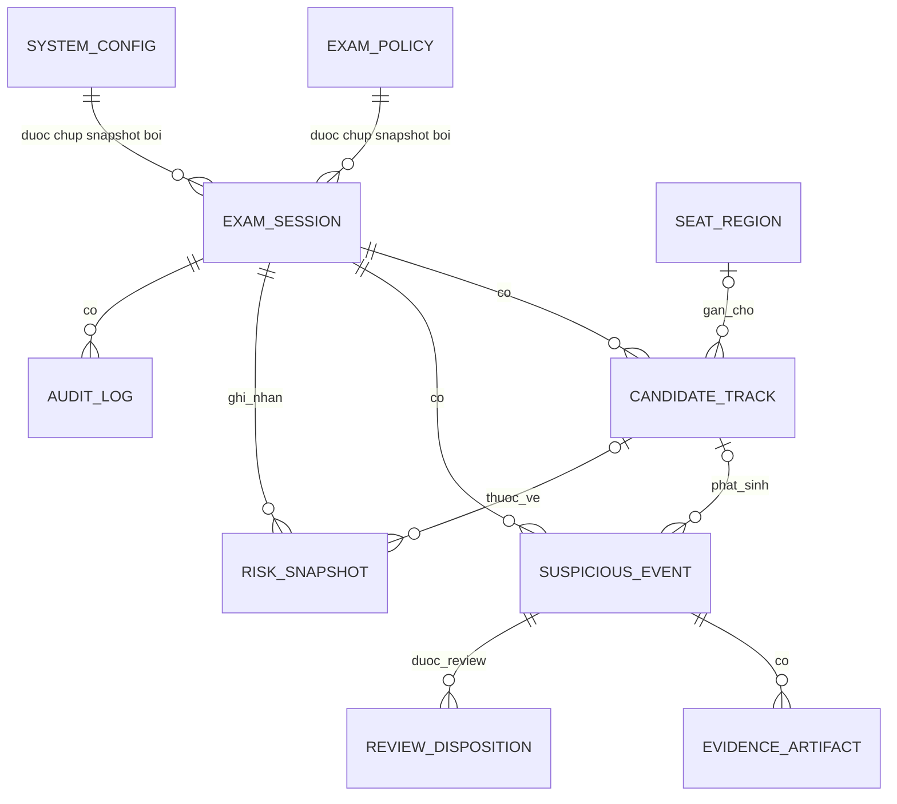

# Mô hình dữ liệu

## Quy ước chung

- ID dùng UUID v4 và được biểu diễn bằng chuỗi chữ thường có dấu gạch nối.
- Timestamp lưu UTC theo ISO 8601. Duration và cửa sổ rule tính bằng monotonic clock trong runtime,
  sau đó lưu dưới dạng số mili giây.
- Tọa độ bbox và landmark trong contract được chuẩn hóa về khoảng 0 đến 1. Adapter có trách nhiệm
  chuyển đổi từ pixel.
- `confidence` nằm trong 0 đến 1. `risk_score` nằm trong 0 đến 100.
- JSON cấu hình được kiểm tra schema trước khi ghi. Session giữ snapshot bất biến của config và policy.
- Observation frame-level chỉ tồn tại trong bộ nhớ, trừ khi một test hoặc chế độ chẩn đoán đã được
  bật rõ. Log production không chứa frame hoặc landmark thô.

## Quan hệ



## 1. ExamSession

Đại diện cho một khoảng thời gian giám sát và là ranh giới cao nhất của dữ liệu nghiệp vụ.

| Trường | Kiểu | Bắt buộc | Quy tắc |
|---|---|---:|---|
| `id` | UUID | Có | Duy nhất |
| `name` | string | Có | 1 đến 120 ký tự, không chứa dữ liệu sinh trắc học |
| `mode` | enum | Có | `SINGLE_PERSON` hoặc `MULTI_PERSON` |
| `status` | enum | Có | Xem state machine bên dưới |
| `camera_source` | string | Có | Device index, file test hoặc URI đã che credential |
| `policy_id` | UUID | Có | Bản policy nguồn |
| `policy_snapshot` | JSON | Có | Bất biến sau khi start |
| `config_version_id` | UUID | Có | Bản config nguồn |
| `config_snapshot` | JSON | Có | Bất biến sau khi start |
| `started_at` | datetime UTC | Không | Có khi chuyển sang `RUNNING` |
| `ended_at` | datetime UTC | Không | Có khi kết thúc hoặc lỗi |
| `current_risk_score` | number | Có | 0 đến 100, mặc định 0 |
| `current_risk_level` | enum | Có | `NORMAL`, `LOW`, `MEDIUM`, `HIGH`, `CRITICAL` |
| `camera_status` | enum | Có | `UNKNOWN`, `CONNECTED`, `DEGRADED`, `DISCONNECTED` |
| `processing_status` | enum | Có | `IDLE`, `LOADING`, `READY`, `DEGRADED`, `FAILED` |
| `failure_code` | string | Không | Mã ổn định, không chứa stack trace |
| `created_by` | string | Có | Subject từ auth provider |
| `created_at` | datetime UTC | Có | Thời điểm tạo |
| `updated_at` | datetime UTC | Có | Thời điểm cập nhật gần nhất |

State machine:

```text
CREATED -> STARTING -> RUNNING -> STOPPING -> STOPPED
                   \-> FAILED
STARTING -----------> FAILED
STOPPING -----------> FAILED
```

Quy tắc:

- Chỉ session `CREATED` mới được start. `STOPPED` là trạng thái terminal; start một session đã dừng
  trả `409 Conflict` và không tái sử dụng temporal state cũ.
- Phase 1 chỉ cho một session ở `STARTING`, `RUNNING` hoặc `STOPPING`.
- Chuyển state phải idempotent. Lệnh start/stop lặp lại với cùng `Idempotency-Key` trả lại kết quả
  đã lưu; một key mới trên lifecycle không hợp lệ trả `409 Conflict`.

## 2. CandidateTrack

Đại diện cho một người ẩn danh do tracker quan sát trong một session.

| Trường | Kiểu | Bắt buộc | Quy tắc |
|---|---|---:|---|
| `id` | UUID | Có | ID bền trong database |
| `session_id` | UUID | Có | Khóa ngoại tới session |
| `runtime_track_id` | integer | Có | ID do tracker cấp, chỉ duy nhất trong session |
| `status` | enum | Có | `ACTIVE`, `OCCLUDED`, `LOST`, `CLOSED` |
| `seat_region_id` | UUID | Không | Chỉ dùng khi cấu hình seat mapping |
| `first_seen_at` | datetime UTC | Có | Lần thấy đầu tiên |
| `last_seen_at` | datetime UTC | Có | Lần thấy gần nhất |
| `lost_at` | datetime UTC | Không | Có khi vào trạng thái `LOST` |
| `closed_at` | datetime UTC | Không | Có khi track kết thúc |
| `current_bbox` | JSON | Không | `{x, y, width, height}`, chuẩn hóa 0 đến 1 |
| `visibility` | number | Không | 0 đến 1 |
| `current_risk_score` | number | Có | 0 đến 100 |
| `current_risk_level` | enum | Có | Theo bảng mức risk |

State machine:

```text
ACTIVE <-> OCCLUDED -> LOST -> ACTIVE
   \-----------> CLOSED
LOST ----------> CLOSED
```

`runtime_track_id` không phải danh tính. Khi recovery không đủ tin cậy, hệ thống tạo track mới thay vì
khẳng định hai track thuộc cùng một người.

## 3. ObservationBundle

Entity runtime, không persist mặc định. Một bundle gom kết quả analyzer cho cùng frame.

| Trường | Kiểu | Bắt buộc | Quy tắc |
|---|---|---:|---|
| `frame_id` | integer | Có | Tăng dần trong session |
| `session_id` | UUID | Có | Session hiện tại |
| `captured_at_utc` | datetime UTC | Có | Dùng trong contract và evidence |
| `captured_at_monotonic_ms` | integer | Có | Tăng dần, dùng cho temporal rule |
| `frame_size` | object | Có | Width và height dương |
| `people` | list | Có | Detection người và track association |
| `objects` | list | Có | Class, confidence, bbox, association |
| `faces` | list | Có | Track, landmark quality, yaw/pitch/roll |
| `poses` | list | Có | Track và keypoint đã chuẩn hóa |
| `hands` | list | Có | Track hoặc `ambiguous` |
| `image_quality` | object | Có | Brightness, entropy, blur, occlusion estimate |
| `analyzer_health` | object | Có | Thời gian chạy và trạng thái từng analyzer |

Quy tắc:

- Timestamp monotonic của bundle sau phải lớn hơn bundle trước.
- Adapter có thể thiếu kết quả, nhưng phải ghi lý do `not_run`, `timeout`, `no_detection` hoặc `error`.
- Không serialize ảnh gốc vào observation.

## 4. SuspiciousEvent

Sự kiện được temporal engine tạo sau khi rule đủ điều kiện.

| Trường | Kiểu | Bắt buộc | Quy tắc |
|---|---|---:|---|
| `id` | UUID | Có | Duy nhất |
| `session_id` | UUID | Có | Khóa ngoại |
| `track_id` | UUID | Không | Null cho event cấp camera/phòng hoặc association ambiguous |
| `event_type` | enum | Có | Danh sách chuẩn bên dưới |
| `status` | enum | Có | `OPEN` hoặc `CLOSED` |
| `severity` | enum | Có | `LOW`, `MEDIUM`, `HIGH`, `CRITICAL` |
| `confidence` | number | Có | 0 đến 1 |
| `risk_delta` | number | Có | Mức thay đổi tại lần cập nhật gần nhất |
| `risk_score_after` | number | Có | 0 đến 100 |
| `started_at` | datetime UTC | Có | Bắt đầu condition đã được hợp nhất |
| `ended_at` | datetime UTC | Không | Bắt buộc khi `CLOSED` |
| `duration_ms` | integer | Không | Không âm; bắt buộc khi `CLOSED` |
| `reason_codes` | list[string] | Có | Ít nhất một mã rule ổn định |
| `explanation` | string | Có | Mô tả dữ liệu và threshold đã kích hoạt |
| `metrics` | JSON | Có | Giá trị đo liên quan, không chứa ảnh |
| `policy_version` | string | Có | Version từ session snapshot |
| `config_version` | string | Có | Version từ session snapshot |
| `created_at` | datetime UTC | Có | Thời điểm persist |
| `updated_at` | datetime UTC | Có | Thời điểm update cuối |

Event type:

```text
HEAD_TURN_LEFT
HEAD_TURN_RIGHT
LOOK_DOWN
ABNORMAL_HEAD_MOVEMENT
PHONE_DETECTED
DOCUMENT_DETECTED
MULTIPLE_PERSON_DETECTED
PERSON_MISSING
LEAVING_SEAT
CAMERA_BLOCKED
FACE_NOT_VISIBLE
SUSPICIOUS_HAND_ACTIVITY
POSSIBLE_TALKING
```

Quy tắc lifecycle:

- Chỉ có một event `OPEN` cho cùng `session_id`, `track_id`, `event_type` và rule key.
- Event đang mở được cập nhật `confidence`, `metrics`, `risk_score_after` và `updated_at`.
- Khi đóng, `ended_at >= started_at` và `duration_ms` phải khớp tolerance của clock.
- `LOOK_DOWN`, `SUSPICIOUS_HAND_ACTIVITY` hoặc `POSSIBLE_TALKING` độc lập không được tạo risk cao trái
  với policy an toàn trong constitution.

## 5. EvidenceArtifact

Metadata của frame hoặc clip phục vụ review.

| Trường | Kiểu | Bắt buộc | Quy tắc |
|---|---|---:|---|
| `id` | UUID | Có | Duy nhất |
| `event_id` | UUID | Có | Khóa ngoại |
| `kind` | enum | Có | `FRAME` hoặc `CLIP` |
| `status` | enum | Có | `PENDING`, `AVAILABLE`, `FAILED`, `DELETED` |
| `relative_path` | string | Không | Chỉ có khi available; không được thoát storage root |
| `media_type` | string | Không | `image/jpeg` hoặc loại video được cấu hình |
| `size_bytes` | integer | Không | Không âm |
| `sha256` | string | Không | 64 ký tự hex khi available |
| `captured_from` | datetime UTC | Không | Bắt đầu khoảng evidence |
| `captured_to` | datetime UTC | Không | Kết thúc khoảng evidence |
| `retention_until` | datetime UTC | Có | Theo policy snapshot |
| `failure_code` | string | Không | Bắt buộc nếu failed |
| `created_at` | datetime UTC | Có | Thời điểm tạo metadata |
| `deleted_at` | datetime UTC | Không | Có khi file đã xóa |

State machine:

```text
PENDING -> AVAILABLE -> DELETED
   \----> FAILED ----> DELETED
```

Không trả `relative_path` trực tiếp cho client. API stream file sau khi authorization và audit thành công.

## 6. RiskSnapshot

Ghi lại thay đổi risk có ý nghĩa, không ghi mỗi frame.

| Trường | Kiểu | Bắt buộc | Quy tắc |
|---|---|---:|---|
| `id` | UUID | Có | Duy nhất |
| `session_id` | UUID | Có | Khóa ngoại |
| `track_id` | UUID | Không | Null cho risk cấp session |
| `score_before` | number | Có | 0 đến 100 |
| `score_after` | number | Có | 0 đến 100 |
| `level_after` | enum | Có | Mức tương ứng với score |
| `reason` | enum | Có | `EVENT_OPEN`, `EVENT_UPDATE`, `CORRELATION`, `DECAY`, `RESET` |
| `contributing_event_ids` | list[UUID] | Có | Có thể rỗng khi decay/reset |
| `reason_codes` | list[string] | Có | Giải thích phép tính |
| `occurred_at` | datetime UTC | Có | Thời điểm thay đổi |

Chỉ persist khi score thay đổi vượt epsilon cấu hình, level thay đổi hoặc có event transition.

## 7. ExamPolicy

Quy tắc của một loại kỳ thi. Session dùng snapshot để tránh thay đổi giữa chừng.

| Trường | Kiểu | Bắt buộc | Quy tắc |
|---|---|---:|---|
| `id` | UUID | Có | Duy nhất |
| `name` | string | Có | 1 đến 120 ký tự |
| `version` | integer | Có | Tăng khi cập nhật |
| `allow_book` | boolean | Có | Mặc định false |
| `allow_scratch_paper` | boolean | Có | Mặc định true theo baseline README |
| `allow_phone` | boolean | Có | Mặc định false |
| `allowed_materials` | list[string] | Có | Danh sách mở rộng có kiểm soát |
| `evidence_frame_enabled` | boolean | Có | Mặc định true |
| `evidence_clip_enabled` | boolean | Có | Mặc định false cho đến khi operator bật |
| `pre_event_seconds` | number | Có | 0 đến giới hạn hệ thống |
| `post_event_seconds` | number | Có | 0 đến giới hạn hệ thống |
| `retention_days` | integer | Có | Lớn hơn 0, do đơn vị vận hành quyết định |
| `created_by` | string | Có | Subject của admin |
| `created_at` | datetime UTC | Có | Thời điểm tạo |
| `updated_at` | datetime UTC | Có | Thời điểm cập nhật |

## 8. SystemConfigVersion

Cấu hình kỹ thuật và rule đã được kiểm tra schema.

| Trường | Kiểu | Bắt buộc | Quy tắc |
|---|---|---:|---|
| `id` | UUID | Có | Duy nhất |
| `version` | integer | Có | Tăng dần |
| `status` | enum | Có | `DRAFT`, `ACTIVE`, `RETIRED` |
| `content` | JSON | Có | Khớp schema config |
| `sha256` | string | Có | Hash canonical JSON |
| `created_by` | string | Có | Subject của admin |
| `created_at` | datetime UTC | Có | Thời điểm tạo |
| `activated_at` | datetime UTC | Không | Có khi active |

Các nhóm bắt buộc trong `content`:

```text
camera
detection
behavior.head_turn
behavior.look_down
behavior.abnormal_head_movement
behavior.phone
behavior.document
behavior.person_missing
behavior.multiple_person
behavior.leaving_seat
behavior.camera_blocked
behavior.face_not_visible
behavior.hand_activity
risk
evidence
runtime
```

Chỉ một config ở trạng thái `ACTIVE`. Update tạo version mới, không sửa bản cũ.

## 9. ReviewDisposition

Ghi quyết định xem xét của con người về chất lượng tín hiệu, không ghi phán quyết gian lận.

| Trường | Kiểu | Bắt buộc | Quy tắc |
|---|---|---:|---|
| `id` | UUID | Có | Duy nhất |
| `event_id` | UUID | Có | Khóa ngoại |
| `disposition` | enum | Có | `VALID_SIGNAL`, `FALSE_POSITIVE`, `INCONCLUSIVE` |
| `note` | string | Không | Tối đa 2000 ký tự; không thêm dữ liệu không cần thiết |
| `reviewed_by` | string | Có | Subject của reviewer |
| `reviewed_at` | datetime UTC | Có | Thời điểm ghi nhận |

Mỗi lần review tạo bản ghi mới để giữ audit trail. API trả disposition mới nhất cùng lịch sử khi role cho phép.

## 10. AuditLog

Ghi truy cập hoặc thay đổi dữ liệu nhạy cảm.

| Trường | Kiểu | Bắt buộc | Quy tắc |
|---|---|---:|---|
| `id` | UUID | Có | Duy nhất |
| `session_id` | UUID | Không | Có nếu hành động thuộc session |
| `actor_id` | string | Có | Subject đã xác thực |
| `actor_role` | enum | Có | `operator`, `reviewer`, `admin` |
| `action` | string | Có | Mã ổn định như `EVIDENCE_VIEWED` |
| `resource_type` | string | Có | Loại tài nguyên |
| `resource_id` | string | Có | ID tài nguyên |
| `outcome` | enum | Có | `ALLOWED`, `DENIED`, `FAILED` |
| `request_id` | string | Có | Correlation ID |
| `details` | JSON | Có | Metadata tối thiểu, không chứa ảnh hoặc token |
| `occurred_at` | datetime UTC | Có | Thời điểm hành động |

Audit log là append-only ở tầng ứng dụng. Retention của audit có policy riêng và không ngắn hơn retention evidence.

## 11. SeatRegion

Entity Phase 2 dùng cho camera cố định.

| Trường | Kiểu | Bắt buộc | Quy tắc |
|---|---|---:|---|
| `id` | UUID | Có | Duy nhất |
| `room_key` | string | Có | Mã phòng do operator cấu hình |
| `seat_key` | string | Có | Duy nhất trong room |
| `polygon` | list[point] | Có | Tối thiểu 3 điểm, tọa độ chuẩn hóa |
| `enabled` | boolean | Có | Có thể tắt mà không xóa lịch sử |
| `created_at` | datetime UTC | Có | Thời điểm tạo |
| `updated_at` | datetime UTC | Có | Thời điểm cập nhật |

Polygon không được tự cắt và phải nằm trong frame. Một điểm có thể nằm sát biên hai seat; association
phải dùng hysteresis thay vì đổi seat theo một frame.

## Index và ràng buộc persistence

| Bảng | Index hoặc constraint |
|---|---|
| `exam_sessions` | `(status)`, `(created_at DESC)` |
| `candidate_tracks` | unique `(session_id, runtime_track_id)`, index `(session_id, status)` |
| `suspicious_events` | `(session_id, started_at DESC)`, `(track_id, started_at DESC)`, `(event_type, severity)` |
| `evidence_artifacts` | `(event_id)`, `(retention_until, status)` |
| `risk_snapshots` | `(session_id, occurred_at)`, `(track_id, occurred_at)` |
| `exam_policies` | unique `(name, version)` |
| `system_config_versions` | unique `(version)`, tối đa một row `ACTIVE` |
| `review_dispositions` | `(event_id, reviewed_at DESC)` |
| `audit_logs` | `(resource_type, resource_id, occurred_at)`, `(actor_id, occurred_at)` |
| `seat_regions` | unique `(room_key, seat_key)` |

## Quy tắc xóa

- Không cascade xóa session đang chạy.
- Xóa evidence phải xóa file trước, sau đó chuyển metadata sang `DELETED`. Job được phép chạy lại.
- Hết retention không tự xóa event metadata nếu policy cần giữ số liệu đã khử nhận dạng.
- Xóa policy hoặc config đã được session tham chiếu bị cấm; chỉ được chuyển sang retired.
- Observation và frame buffer được giải phóng khi session dừng hoặc runner lỗi.
