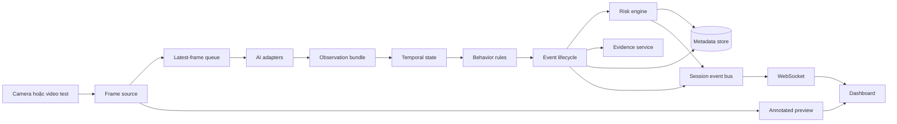

# Kế hoạch triển khai: Smart Exam Proctoring System

**Feature**: `001-smart-exam-proctoring` | **Ngày**: 2026-09-19 | **Spec**: [spec.md](./spec.md)

**Đầu vào**: Đặc tả tại `specs/001-smart-exam-proctoring/spec.md`

## Tóm tắt

Hệ thống theo dõi kỳ thi từ camera, tạo sự kiện nghi vấn có bằng chứng và xếp mức ưu tiên để giám
thị xem lại. Phase 1 phục vụ một thí sinh trên máy cục bộ. Phase 2 mở rộng cùng mô hình domain sang
nhiều track, thêm liên kết vật thể với người và màn hình tổng quan phòng thi.

Giải pháp gồm một backend Python phụ trách camera, suy luận, luật thời gian, sự kiện, risk score và
lưu trữ; một giao diện React hiển thị preview, trạng thái, timeline và màn hình review. Pipeline xử lý
frame chạy ngoài event loop của API. Hàng đợi có kích thước giới hạn và được phép bỏ frame cũ khi hệ
thống chậm để không tích lũy độ trễ. Các detector, tracker và bộ phân tích landmark nằm sau interface
riêng; domain chỉ nhận observation đã chuẩn hóa.

## Bối cảnh kỹ thuật

**Ngôn ngữ/phiên bản**: Python 3.12.x; TypeScript 5.x; React 19.x; Node.js bản LTS đang được hỗ trợ

**Phụ thuộc chính**: FastAPI, Uvicorn, Pydantic Settings, SQLAlchemy 2, Alembic, OpenCV, NumPy,
PyTorch, Ultralytics YOLO, MediaPipe Tasks, React, Vite, Tailwind CSS

**Lưu trữ**: SQLite trên đĩa cục bộ ở Phase 1; thư mục evidence theo session; PostgreSQL và object
storage tương thích S3 ở Phase 2 hoặc khi triển khai nhiều máy

**Kiểm thử**: pytest, pytest-asyncio, HTTPX/TestClient, Vitest, React Testing Library, Playwright,
bộ video regression có manifest và công cụ benchmark riêng

**Nền tảng đích**: Windows 10/11 và Linux x86-64; webcam USB hoặc camera mà OpenCV đọc được; CPU
được hỗ trợ cho chế độ phát triển, GPU NVIDIA là môi trường tham chiếu cho mục tiêu realtime

**Loại dự án**: Monorepo web app chạy cục bộ, gồm API Python, pipeline Computer Vision và frontend

**Mục tiêu hiệu năng**: Input 1280x720; tối thiểu 15 FPS trên GPU tham chiếu, ưu tiên 20 đến 30 FPS;
95% event/status update xuất hiện trong 300 ms sau khi đủ điều kiện; thao tác start/stop phản hồi
trong 2 giây ở ít nhất 95% lần thử

**Ràng buộc**: Không kết luận gian lận; không phát event quan trọng từ một frame; risk score nằm
trong 0 đến 100; không lưu toàn bộ video mặc định; không nhận diện danh tính; mọi threshold và policy
phải cấu hình được; model và camera không được chặn event loop của API

**Quy mô/phạm vi**: Phase 1 có một camera, một session đang chạy và một thí sinh kỳ vọng. Phase 2
đo ở 1, 5, 10 và tối đa 20 người tùy cấu hình phần cứng. Dữ liệu mặc định chỉ gồm metadata, event
frame và clip ngắn khi policy cho phép.

## Kiểm tra constitution

*Gate trước nghiên cứu: đạt. Kiểm tra lại sau thiết kế: đạt.*

| Nguyên tắc | Cách đáp ứng | Kết quả |
|---|---|---|
| Con người quyết định cuối cùng | Event, risk và review disposition là các khái niệm tách biệt; API không có trường `cheating=true` | Đạt |
| Dựa trên chuỗi thời gian | Temporal buffer dùng đồng hồ monotonic; event có lifecycle mở/đóng và điều kiện duration/frequency | Đạt |
| Policy và threshold là cấu hình | Session chụp snapshot của config và exam policy; rule không chứa số cố định | Đạt |
| Tách AI khỏi luật nghiệp vụ | Adapter AI trả observation; `proctoring_core` đánh giá rule, event và risk | Đạt |
| Quyền riêng tư theo thiết kế | Observation không được lưu mặc định; evidence có retention, authorization và audit | Đạt |
| Chất lượng phải đo được | Có unit, contract, integration, video regression, benchmark và báo cáo metric | Đạt |

Không có ngoại lệ constitution. Giấy phép của Ultralytics là gate phát hành: dự án phải tuân thủ
AGPL-3.0 hoặc có giấy phép Enterprise trước khi phân phối theo mô hình không tương thích AGPL.

## Kiến trúc xử lý



Mỗi `SessionRunner` sở hữu camera, pipeline và temporal state của một session. Phase 1 chỉ cho phép
một runner hoạt động. Worker lấy frame mới nhất từ hàng đợi giới hạn; frame cũ được bỏ và ghi metric
`dropped_frames`. Thời lượng hành vi dùng monotonic clock, còn timestamp lưu trữ dùng UTC.

API đọc metadata qua repository và nhận event qua session event bus. Preview dùng luồng MJPEG riêng
để payload JSON của WebSocket chỉ mang trạng thái và event. Khi WebSocket kết nối lại, frontend lấy
snapshot từ REST rồi tiếp tục nhận update mới theo `sequence`.

## Cấu trúc dự án

### Tài liệu của feature

```text
specs/001-smart-exam-proctoring/
├── plan.md
├── research.md
├── data-model.md
├── quickstart.md
├── contracts/
│   ├── openapi.yaml
│   └── websocket-events.md
└── tasks.md                 # Sinh ở bước $speckit-tasks
```

### Source code tại repository root

```text
apps/
├── api/
│   ├── src/proctoring_api/
│   │   ├── main.py
│   │   ├── routes/
│   │   ├── realtime/
│   │   ├── auth/
│   │   └── persistence/
│   └── tests/
└── web/
    ├── src/
    │   ├── components/
    │   ├── features/
    │   ├── pages/
    │   ├── services/
    │   └── types/
    └── tests/

packages/
├── proctoring_core/
│   ├── src/proctoring_core/
│   │   ├── behavior/
│   │   ├── config/
│   │   ├── events/
│   │   ├── risk/
│   │   ├── sessions/
│   │   └── ports/
│   └── tests/
└── proctoring_ai/
    ├── src/proctoring_ai/
    │   ├── capture/
    │   ├── detectors/
    │   ├── face/
    │   ├── hands/
    │   ├── pose/
    │   ├── tracking/
    │   ├── features/
    │   └── pipeline/
    └── tests/

configs/
├── default.yaml
└── exam_policy.yaml

datasets/
├── raw/
├── processed/
└── annotations/

models/
├── pretrained/
└── custom/

storage/
└── sessions/

tests/
├── contract/
├── integration/
├── video_samples/
└── performance/

scripts/
├── evaluate.py
├── benchmark.py
└── retention.py

docker/
docs/
pyproject.toml
uv.lock
package.json
docker-compose.yml
```

**Quyết định cấu trúc**: Monorepo có hai ứng dụng và hai package Python. `proctoring_ai` phụ thuộc vào
model và thư viện thị giác máy tính. `proctoring_core` không import framework AI, API hay database.
`proctoring_api` ghép các adapter với domain và chịu trách nhiệm persistence, auth, REST, preview,
WebSocket. Cách chia này giữ ranh giới AI và nghiệp vụ, đồng thời cho phép thay YOLO, MediaPipe,
tracker hoặc storage mà không sửa rule.

## Phạm vi triển khai theo giai đoạn

### Phase 1

1. Khung ứng dụng, cấu hình, database, session lifecycle, health và logging.
2. Camera, preview, person detection, trạng thái một người, person missing và multiple person.
3. Face landmark, head pose, head turn, look down và abnormal head movement.
4. Phone, document, camera blocked, face not visible, leaving seat và tín hiệu tay hỗ trợ.
5. Event lifecycle, risk, evidence, timeline, review disposition, retention và audit.
6. Video regression, benchmark, phân tích false alert và điều chỉnh threshold.

### Phase 2

1. Multi-object tracker và lifecycle từng track.
2. Temporal state, event và risk độc lập theo track.
3. Object-to-person association, trạng thái ambiguous và seat mapping.
4. Room dashboard, candidate detail, event replay và metric tracking.
5. Benchmark theo số người, sau đó mới xem xét ONNX Runtime hoặc TensorRT.

## Kiểm tra constitution sau thiết kế

- Domain không chứa kết luận gian lận và không phụ thuộc framework AI.
- Event engine chỉ nhận observation có timestamp và đánh giá theo cửa sổ thời gian.
- Config cùng policy được version hóa và chụp snapshot vào session.
- Observation frame-level không được persist mặc định; evidence đi qua service có retention và audit.
- Mỗi feature AI có đường test từ unit đến video regression và benchmark.
- Phase 2 tái sử dụng contract event/risk của Phase 1, không bỏ qua safeguard hiện có.

Kết quả: đạt toàn bộ gate, không còn câu hỏi mở và không cần ghi nhận vi phạm kiến trúc.
